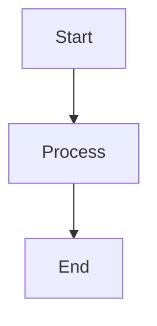

# Система тестирования Content Generator

## Содержание

- [Обзор](#обзор)
- [Архитектура тестов](#архитектура-тестов)
- [Структура тестов](#структура-тестов)
- [Типы тестов](#типы-тестов)
- [Инструменты и конфигурация](#инструменты-и-конфигурация)
- [Фикстуры и моки](#фикстуры-и-моки)
- [Паттерны тестирования](#паттерны-тестирования)
- [Примеры тестов](#примеры-тестов)
- [Запуск тестов](#запуск-тестов)
- [Best Practices](#best-practices)
- [Расширение тестовой базы](#расширение-тестовой-базы)

---

## Обзор

Система тестирования Content Generator построена на базе **pytest** и следует принципам модульного, интеграционного и end-to-end тестирования. Тесты покрывают все ключевые компоненты системы: агенты, валидаторы, контекст учебного плана, утилиты и конфигурацию.

### Основные принципы

- **Изоляция**: Каждый тест независим и может выполняться отдельно
- **Повторяемость**: Тесты дают одинаковые результаты при повторных запусках
- **Быстрота**: Unit-тесты выполняются быстро, без внешних зависимостей
- **Покрытие**: Тесты покрывают критичные пути выполнения кода
- **Читаемость**: Тесты служат документацией к коду

---

## Архитектура тестов

### Общая структура

```
tests/
├── __init__.py
├── conftest.py              # Общие фикстуры и конфигурация pytest
│
├── agents/                  # Тесты агентов
│   ├── test_flow_runner.py
│   └── test_practice_critic.py
│
├── config/                  # Тесты конфигурации
│   └── test_loader.py
│
├── integration/             # Интеграционные тесты
│   └── test_generation_flow.py
│
├── curriculum/              # Тесты контекста учебного плана
│   └── test_curriculum_graph.py
│
├── utils/                   # Тесты утилит
│   ├── test_latex_validator.py
│   ├── test_patch_format.py
│   └── test_protected_blocks.py
│
└── validators/              # Тесты валидаторов
    └── rubric/
        ├── test_annotation_checker.py
        ├── test_chapter1_checker.py
        └── test_scorer.py
```

### Диаграмма уровней тестирования

```
                    ┌─────────────────────┐
                    │   E2E Tests         │  (Планируется)
                    │   Полный pipeline   │
                    └──────────┬──────────┘
                               │
                    ┌──────────▼──────────┐
                    │ Integration Tests   │  ◄── test_generation_flow.py
                    │ Orchestrator Flow   │
                    └──────────┬──────────┘
                               │
        ┌──────────────────────┼──────────────────────┐
        │                      │                      │
┌───────▼────────┐    ┌────────▼────────┐    ┌───────▼────────┐
│ Agent Tests    │    │ Validator Tests │    │ Context Tests  │
│ Flow Runner    │    │ Rubric Scorer   │    │ Curriculum     │
│ Practice Critic│    │ Section Checkers│    │ Curriculum     │
└────────────────┘    └─────────────────┘    └────────────────┘
        │                      │                      │
        └──────────────────────┼──────────────────────┘
                               │
                    ┌──────────▼──────────┐
                    │  Unit Tests         │
                    │  Utils, Config      │
                    │  Protected Blocks   │
                    │  LaTeX Validator    │
                    │  Patch Format       │
                    └─────────────────────┘
```

---

## Структура тестов

### Организация по модулям

#### 1. **tests/agents/** — Тесты агентов

Тестируют логику работы агентов и их взаимодействие:

- `test_flow_runner.py` — тесты `AgentFlowRunner` (топологическая сортировка, циклы, выполнение)
- `test_practice_critic.py` — тесты `PracticeCriticAgent` (парсинг JSON, обработка ошибок)

#### 2. **tests/validators/rubric/** — Тесты валидаторов

Тестируют систему проверки критериев:

- `test_scorer.py` — основной класс `RubricScorer`
- `test_annotation_checker.py` — проверка аннотации
- `test_chapter1_checker.py` — проверка Главы 1

#### 3. **tests/integration/** — Интеграционные тесты

Тестируют полный flow генерации контента:

- `test_generation_flow.py` — полный цикл через `Orchestrator`

#### 4. **tests/curriculum/** — Тесты контекста учебного плана

Тестируют работу с графом учебной программы:

- `test_curriculum_graph.py` — построение графа, поиск соседей, анализ позиции

#### 5. **tests/utils/** — Тесты утилит

Тестируют вспомогательные функции:

- `test_protected_blocks.py` — защита/восстановление блоков (mermaid, code, формулы)
- `test_latex_validator.py` — валидация LaTeX-формул
- `test_patch_format.py` — применение патчей к markdown

#### 6. **tests/config/** — Тесты конфигурации

Тестируют загрузку и кеширование конфигов:

- `test_loader.py` — загрузка agent config, кеширование

---

## Типы тестов

### 1. Unit-тесты

**Назначение**: Тестирование отдельных функций и классов в изоляции.

**Характеристики**:
- Быстрые (миллисекунды)
- Не требуют внешних зависимостей
- Используют моки для LLM, embedding функций
- Покрывают edge cases и валидацию

**Примеры**:
- Тесты парсинга JSON в `PracticeCriticAgent`
- Тесты валидации патчей
- Тесты защиты/восстановления блоков

**Маркер**: `@pytest.mark.unit` (опционально)

### 2. Интеграционные тесты

**Назначение**: Тестирование взаимодействия нескольких компонентов.

**Характеристики**:
- Средняя скорость (секунды)
- Могут использовать моки для внешних API
- Тестируют реальные потоки данных между компонентами

**Примеры**:
- `test_generation_flow.py` — полный flow через Orchestrator
- Тесты взаимодействия агентов в flow

**Маркер**: `@pytest.mark.integration`

### 3. Медленные тесты (Slow Tests)

**Назначение**: Тесты, требующие реальных вызовов LLM API.

**Характеристики**:
- Медленные (секунды-минуты)
- Требуют API ключи
- Используются для валидации промптов и поведения LLM

**Маркер**: `@pytest.mark.slow`

**Запуск**:
```bash
pytest -m slow          # Только медленные тесты
pytest -m "not slow"    # Исключить медленные тесты
```

---

## Инструменты и конфигурация

### Основные инструменты

#### pytest

Основной фреймворк для тестирования.

**Конфигурация** (`pytest.ini` / `pyproject.toml`):

```ini
[pytest]
testpaths = tests
python_files = test_*.py
python_classes = Test*
python_functions = test_*
addopts = 
    -v
    --strict-markers
    --tb=short
    --disable-warnings
markers =
    unit: Unit тесты
    integration: Интеграционные тесты
    slow: Медленные тесты (требуют LLM API)
```

**Ключевые опции**:
- `-v` — verbose режим
- `--strict-markers` — строгая проверка маркеров
- `--tb=short` — короткий traceback
- `--disable-warnings` — отключение предупреждений

#### unittest.mock

Для создания моков и патчей:

- `Mock` — базовый мок-объект
- `MagicMock` — мок с автоматическими атрибутами
- `monkeypatch` (pytest) — патчинг модулей и функций

### Структура конфигурации

```
pytest.ini / pyproject.toml
    │
    ├── testpaths: ["tests"]
    ├── python_files: ["test_*.py"]
    ├── python_classes: ["Test*"]
    ├── python_functions: ["test_*"]
    ├── addopts: опции запуска
    └── markers: маркеры для категоризации
```

---

## Фикстуры и моки

### Общие фикстуры (conftest.py)

#### `mock_llm_client`

Мок LLM клиента для изоляции тестов от реальных API вызовов.

```python
@pytest.fixture
def mock_llm_client():
    """Создает мок LLM клиента."""
    client = Mock(spec=LLMClient)
    client.complete = MagicMock(return_value='{"result": "test"}')
    return client
```

**Использование**:
```python
def test_agent_process(mock_llm_client):
    agent = SomeAgent(mock_llm_client)
    result = agent.process({})
    assert result is not None
```

#### `mock_embedding_function`

Мок функции эмбеддингов для тестов валидаторов.

```python
@pytest.fixture
def mock_embedding_function():
    """Создает мок функции эмбеддингов."""
    def mock_embed(texts):
        return [[0.1] * 768 for _ in texts]
    return mock_embed
```

**Использование**:
```python
def test_annotation_checker(mock_llm_client, mock_embedding_function):
    checker = AnnotationChecker(
        llm_client=mock_llm_client,
        embedding_function=mock_embedding_function
    )
    results = checker.check(annotation, title)
```

#### `sample_markdown`

Пример markdown документа для тестирования валидаторов.

```python
@pytest.fixture
def sample_markdown():
    """Пример markdown для тестирования."""
    return """# Проект: Тестовый проект

## Содержание
...
"""
```

#### `sample_annotation`

Пример аннотации проекта.

```python
@pytest.fixture
def sample_annotation():
    """Пример аннотации для тестирования."""
    return """Проект предназначен для изучения основ программирования..."""
```

### Локальные фикстуры

Фикстуры, определенные в конкретных тестовых файлах:

```python
@pytest.fixture
def regex_patterns(self):
    """Фикстура с регулярными выражениями."""
    return {
        "rx_h3": re.compile(r"^###\s+(.+)$", re.M),
        "rx_directives": [...]
    }
```

### Моки для специфичных случаев

#### DummyLLM

Простой мок LLM для интеграционных тестов:

```python
class DummyLLM:
    def __init__(self, response: str):
        self.response = response
        self.calls = []
    
    def complete(self, **kwargs):
        self.calls.append(kwargs)
        return self.response
```

**Использование**:
```python
def test_orchestrator_flow(monkeypatch):
    llm = DummyLLM("ok")
    orchestrator = Orchestrator(llm)
    result = orchestrator.run_v2(...)
```

---

## Паттерны тестирования

### 1. Arrange-Act-Assert (AAA)

Стандартный паттерн организации тестов:

```python
def test_example():
    # Arrange — подготовка данных
    checker = AnnotationChecker(...)
    annotation = "Тестовая аннотация"
    
    # Act — выполнение действия
    results = checker.check(annotation, "Заголовок")
    
    # Assert — проверка результата
    assert len(results) > 0
    assert results[0].score >= 0
```

### 2. Тестирование инициализации

Проверка корректной инициализации объектов:

```python
def test_init(self, mock_llm_client):
    """Тест инициализации RubricScorer."""
    scorer = RubricScorer(language="ru", llm_client=mock_llm_client)
    assert scorer.lang == "ru"
    assert scorer.llm == mock_llm_client
    assert scorer.rx_h1 is not None
```

### 3. Тестирование граничных случаев

Проверка обработки пустых данных, некорректных входов:

```python
def test_score_empty_markdown(self, mock_llm_client):
    """Тест оценки пустого markdown."""
    scorer = RubricScorer(language="ru", llm_client=mock_llm_client)
    report = scorer.score("")
    
    assert isinstance(report, CriteriaReport)
    failed_items = [item for item in report.items if item.score == 0]
    assert len(failed_items) > 0
```

### 4. Тестирование обработки ошибок

Проверка корректной обработки некорректных данных:

```python
def test_practice_critic_handles_invalid_json(monkeypatch):
    llm = DummyLLM("not-json")
    agent = PracticeCriticAgent(llm)
    issues = agent.review(...)
    
    assert issues == []  # Должен вернуть пустой список при ошибке
```

### 5. Round-trip тестирование

Проверка полного цикла преобразования:

```python
def test_round_trip_simple(self):
    """Тест полного цикла protect -> restore."""
    original = "# Заголовок\n\n$$E = mc^2$$\n\n```mermaid\n...\n```"
    
    protected, blocks = protect_blocks(original)
    restored = restore_blocks(protected, blocks)
    
    assert "$$E = mc^2$$" in restored
    assert "```mermaid" in restored
```

### 6. Тестирование с monkeypatch

Изоляция зависимостей через патчинг:

```python
def test_get_agent_config_reads_yaml_and_caches(monkeypatch, tmp_path):
    # Подготовка временной структуры
    repo_root = tmp_path / "repo"
    ...
    
    # Патчинг глобальных переменных
    monkeypatch.setattr(loader, "REPO_ROOT", repo_root)
    monkeypatch.setattr(loader, "CONFIG_ROOT", config_root)
    
    # Сброс кешей
    _reset_loader_caches(monkeypatch)
    
    # Тестирование
    cfg1 = loader.get_agent_config("demo")
    cfg2 = loader.get_agent_config("demo")
    
    assert cfg1 is cfg2  # Проверка кеширования
```

### 7. Тестирование структуры данных

Проверка корректности структуры результатов:

```python
def test_check_valid_annotation(self, ...):
    results = checker.check(sample_annotation, "Тестовый проект")
    
    assert len(results) > 0
    for item in results:
        assert hasattr(item, 'id')
        assert hasattr(item, 'title')
        assert hasattr(item, 'score')
        assert hasattr(item, 'check_method')
```

---

## Примеры тестов

### Пример 1: Unit-тест валидатора

```python
class TestAnnotationChecker:
    """Тесты для проверки аннотации."""
    
    def test_check_annotation_length(self, mock_llm_client, mock_embedding_function):
        """Тест проверки длины аннотации."""
        checker = AnnotationChecker(
            llm_client=mock_llm_client,
            embedding_function=mock_embedding_function
        )
        
        # Слишком короткая аннотация
        short_annotation = "Короткая аннотация."
        results = checker.check(short_annotation, "Тестовый проект")
        
        # Должен быть критерий 2.1.1 (длина)
        length_item = next((item for item in results if item.id == "2.1.1"), None)
        if length_item:
            assert length_item.score == 0
```

### Пример 2: Интеграционный тест flow

```python
def test_flow_runner_executes_in_topological_order():
    runner = AgentFlowRunner(make_flow_definition())
    context = {}
    order = []
    
    registry = {
        "start": lambda ctx: order.append("start") or FlowNodeOutput(updates={"value": 1}),
        "middle": lambda ctx: order.append("middle") or FlowNodeOutput(updates={"value": ctx["value"] + 1}),
        "end": lambda ctx: order.append("end") or FlowNodeOutput(updates={"value": ctx["value"] + 1}),
    }
    
    steps = runner.run(context, registry)
    assert context["value"] == 3
    assert order == ["start", "middle", "end"]
```

### Пример 3: Тест обработки ошибок

```python
def test_flow_runner_raises_on_missing_handler():
    runner = AgentFlowRunner(make_flow_definition())
    with pytest.raises(RuntimeError):
        runner.run({}, registry={"start": lambda ctx: FlowNodeOutput()})
```

### Пример 4: Тест с валидацией структуры

```python
def test_score_valid_markdown(self, mock_llm_client, sample_markdown):
    """Тест оценки валидного markdown."""
    scorer = RubricScorer(language="ru", llm_client=mock_llm_client)
    report = scorer.score(sample_markdown)
    
    assert isinstance(report, CriteriaReport)
    assert len(report.items) > 0
    assert hasattr(report, 'total')
    assert hasattr(report, 'max_score')
    assert hasattr(report, 'items')
    assert report.total >= 0
    assert report.total <= report.max_score
```

### Пример 5: Тест round-trip

```python
def test_round_trip_complex(self):
    """Тест полного цикла для сложного случая."""
    original = """
# Заголовок

$$C = E + B + Q$$

```python
def calculate():
    return 42
```



$$T = T_0 \\times (1 + \\frac{B - B_0}{B_0})$$
"""
    protected, blocks = protect_blocks(original)
    restored = restore_blocks(protected, blocks)
    
    assert len(blocks) == 4
    assert "$$C = E + B + Q$$" in restored
    assert "```python" in restored
    assert "```mermaid" in restored
    assert "$$T = T_0" in restored
```

---

## Запуск тестов

### Базовые команды

```bash
# Запуск всех тестов
pytest

# Запуск с подробным выводом
pytest -v

# Запуск конкретного файла
pytest tests/validators/rubric/test_scorer.py

# Запуск конкретного теста
pytest tests/validators/rubric/test_scorer.py::TestRubricScorer::test_init

# Запуск тестов по паттерну
pytest -k "test_check"

# Запуск только unit-тестов
pytest -m unit

# Запуск только интеграционных тестов
pytest -m integration

# Исключение медленных тестов
pytest -m "not slow"
```

### Параллельный запуск

```bash
# Установка pytest-xdist
pip install pytest-xdist

# Запуск в параллель (4 процесса)
pytest -n 4
```

### Покрытие кода

```bash
# Установка pytest-cov
pip install pytest-cov

# Запуск с покрытием
pytest --cov=content_gen --cov-report=html

# Просмотр отчета
# Открыть htmlcov/index.html
```

### Отладка

```bash
# Запуск с отладчиком (pdb)
pytest --pdb

# Запуск с подробным traceback
pytest --tb=long

# Запуск с выводом print
pytest -s
```

---

## Best Practices

### 1. Именование тестов

- **Файлы**: `test_<module_name>.py`
- **Классы**: `Test<ClassName>`
- **Функции**: `test_<what_is_tested>_<expected_behavior>`

**Примеры**:
```python
def test_check_annotation_length_returns_zero_for_short_text():
    ...

def test_flow_runner_raises_on_missing_handler():
    ...
```

### 2. Документирование тестов

Используйте docstrings для описания назначения теста:

```python
def test_check_empty_annotation(self, ...):
    """Тест проверки пустой аннотации.
    
    Проверяет, что все критерии возвращают score=0
    для пустой строки.
    """
    ...
```

### 3. Изоляция тестов

- Каждый тест должен быть независимым
- Не используйте глобальное состояние
- Используйте фикстуры для подготовки данных
- Очищайте состояние после теста (если необходимо)

### 4. Использование параметризации

Для тестирования множества похожих случаев:

```python
@pytest.mark.parametrize("input,expected", [
    ("", 0),
    ("short", 0),
    ("valid annotation text", 1),
])
def test_annotation_length(input, expected):
    ...
```

### 5. Моки и стабы

- Используйте моки для внешних зависимостей (LLM, DB, API)
- Не мокируйте код, который тестируете
- Проверяйте вызовы моков, если это важно

### 6. Тестирование граничных случаев

Всегда тестируйте:
- Пустые входные данные
- Некорректные входные данные
- Максимальные/минимальные значения
- None значения (если допустимы)

### 7. Структура assert

- Один assert на одну проверку (когда возможно)
- Используйте информативные сообщения об ошибках
- Проверяйте типы данных перед проверкой значений

### 8. Избегайте тестовых данных в коде

Используйте фикстуры или фабрики:

```python
# Плохо
def test_example():
    data = {"field": "value"}  # Хардкод в тесте

# Хорошо
@pytest.fixture
def sample_data():
    return {"field": "value"}

def test_example(sample_data):
    ...
```

---

## Расширение тестовой базы

### Добавление нового теста

1. **Определите тип теста** (unit/integration/slow)
2. **Выберите правильную директорию**:
   - `tests/agents/` — для агентов
   - `tests/validators/` — для валидаторов
   - `tests/utils/` — для утилит
   - `tests/integration/` — для интеграционных тестов

3. **Создайте файл** `test_<module_name>.py`

4. **Напишите тесты**:
```python
"""Тесты для <ModuleName>."""

import pytest
from content_gen.module import ModuleClass


class TestModuleClass:
    """Тесты для ModuleClass."""
    
    def test_init(self, mock_llm_client):
        """Тест инициализации."""
        module = ModuleClass(mock_llm_client)
        assert module.llm == mock_llm_client
    
    def test_process_valid_input(self, ...):
        """Тест обработки валидного входа."""
        ...
```

### Добавление новых фикстур

Добавьте в `tests/conftest.py` или в локальный `conftest.py`:

```python
@pytest.fixture
def new_fixture():
    """Описание фикстуры."""
    # Подготовка данных
    data = ...
    return data
```

### Добавление маркеров

В `pytest.ini` или `pyproject.toml`:

```ini
markers =
    unit: Unit тесты
    integration: Интеграционные тесты
    slow: Медленные тесты (требуют LLM API)
    new_marker: Описание нового маркера
```

### Интеграция с CI/CD

Пример для GitHub Actions:

```yaml
name: Tests

on: [push, pull_request]

jobs:
  test:
    runs-on: ubuntu-latest
    steps:
      - uses: actions/checkout@v2
      - name: Set up Python
        uses: actions/setup-python@v2
        with:
          python-version: '3.10'
      - name: Install dependencies
        run: |
          pip install -r requirements.txt
          pip install pytest pytest-cov
      - name: Run tests
        run: pytest -v --cov=content_gen --cov-report=xml
      - name: Upload coverage
        uses: codecov/codecov-action@v2
```

---

## Диаграмма потока выполнения тестов

```
                    ┌─────────────────┐
                    │  pytest runner  │
                    └────────┬────────┘
                             │
                    ┌────────▼────────┐
                    │  conftest.py    │
                    │  Загрузка       │
                    │  фикстур        │
                    └────────┬────────┘
                             │
        ┌────────────────────┼────────────────────┐
        │                    │                    │
┌───────▼────────┐   ┌────────▼────────┐  ┌───────▼────────┐
│ Unit Tests    │   │ Integration     │  │ Slow Tests     │
│               │   │ Tests           │  │                │
│ - Agents      │   │ - Full Flow     │  │ - LLM API      │
│ - Validators  │   │ - Orchestrator  │  │ - Real Calls   │
│ - Utils       │   │                 │  │                │
└───────┬───────┘   └────────┬────────┘  └───────┬────────┘
        │                    │                    │
        └────────────────────┼────────────────────┘
                             │
                    ┌────────▼────────┐
                    │  Test Results   │
                    │  - Pass/Fail    │
                    │  - Coverage     │
                    │  - Reports      │
                    └─────────────────┘
```

---

## Связанная документация

- [ARCHITECTURE.md](ARCHITECTURE.md) — общая архитектура системы
- [AGENTS.md](AGENTS.md) — описание агентной системы
- [REVERSE_EXTRACTION.md](REVERSE_EXTRACTION.md) — система обратного извлечения данных из README
- [CRITERIA.md](CRITERIA.md) — система валидации и критериев качества
- [API.md](API.md) — REST API документация
- [DEPLOYMENT.md](DEPLOYMENT.md) — инструкции по развертыванию

## Заключение

Система тестирования Content Generator обеспечивает:

- **Надежность**: Покрытие критичных компонентов
- **Скорость**: Быстрые unit-тесты для быстрой обратной связи
- **Изоляция**: Независимость тестов через моки и фикстуры
- **Расширяемость**: Легкое добавление новых тестов
- **Документированность**: Тесты как документация к коду

Следуя описанным практикам, можно поддерживать высокое качество кода и уверенность в его работоспособности.
