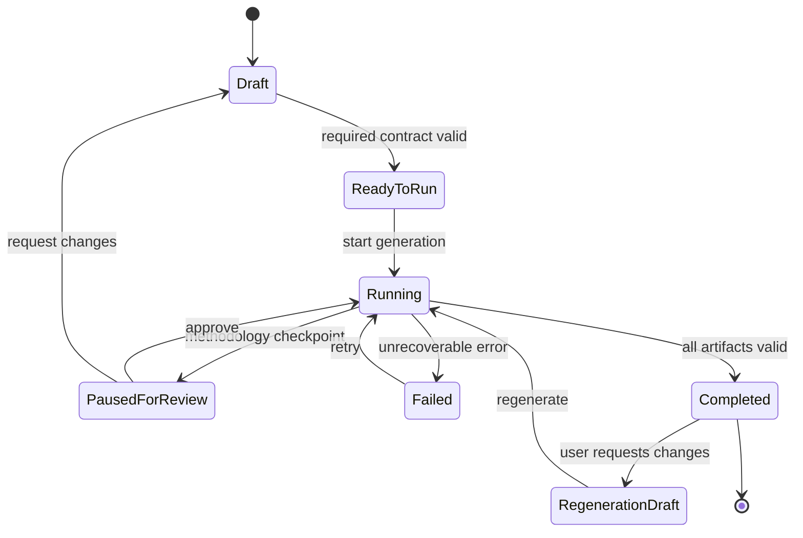

# UI rebuild proposal

## Текущая оценка

Интерфейс сейчас функциональный, но собран как единый технический экран: входные параметры, запуск, логи, методологическая пауза, регенерация, метрики и скачивание находятся почти на одном уровне. Для разработчика это прозрачно, для методолога или PM это создает высокую когнитивную нагрузку.

Основные проблемы:

- слишком длинная форма без явного разделения `required / optional / advanced`;
- основной CTA находится после большого числа полей, поэтому пользователь не видит, что уже достаточно для запуска;
- статусы генерации и действия методолога разнесены по разным зонам;
- регенерация показывается до того, как пользователь увидел итоговый результат;
- вкладки смешивают разные типы сущностей: artifact, diagnostics, review, report, regenerated version;
- темная glassmorphism-тема снижает читаемость длинного markdown и таблиц;
- много inline-style и повторяющихся CSS-правил, из-за чего UI трудно развивать как продукт.

## Целевая информационная архитектура

1. **App shell**
   - режимы: `Генерация`, `Проверка README`, `Перевод`;
   - отдельные рабочие зоны: `Очередь методолога`, `История запусков`, `Метрики качества`, `Шаблоны`.

2. **Generator workspace**
   - верхний stepper: `Контекст -> Учебный план -> Содержание -> Качество -> Запуск`;
   - форма разбита на короткие секции;
   - справа виден readiness checklist и монитор пайплайна;
   - запуск доступен, когда обязательный контракт валиден.

3. **Result workspace**
   - `README` как первая вкладка;
   - `Качество` с rubric score, failed criteria, critic issues;
   - `Методолог` как отдельная зона review/action;
   - `Версии` для regeneration history;
   - `Скачать` как отдельная финальная зона.

## State machine



## Контракты UI-состояния

Минимальный front-end state лучше держать явно:

```ts
type GenerationUiState =
  | "draft"
  | "ready_to_run"
  | "running"
  | "paused_for_review"
  | "failed"
  | "completed"
  | "regeneration_draft";

type ReadinessIssue = {
  id: string;
  severity: "info" | "warning" | "blocking";
  fieldId?: string;
  message: string;
  actionLabel?: string;
};

type PipelineStageView = {
  id: string;
  title: string;
  status: "queued" | "running" | "paused" | "done" | "failed";
  progressPercent?: number;
  currentAgent?: string;
  lastMessage?: string;
};
```

## Рекомендуемая структура фронтенда

Если оставаться на vanilla HTML/JS:

```text
static/
  css/
    tokens.css
    layout.css
    forms.css
    pipeline.css
    markdown.css
  js/
    appState.js
    apiClient.js
    generatorForm.js
    readinessPanel.js
    pipelineMonitor.js
    artifactTabs.js
    methodologyReview.js
```

Если есть ресурс на нормальную пересборку, лучше перейти на React/Vite:

```text
frontend/
  src/
    app/
      routes/
      providers/
    features/
      generation/
        components/
        api/
        model/
      methodology/
      readmeCheck/
      translation/
    shared/
      ui/
      api/
      lib/
```

## Нужно ли подключать MCP сервер в Codex

Для этого редизайна отдельный MCP сервер не обязателен. Достаточно локального кода, браузерной проверки и, при необходимости, Playwright/browser-use для скриншотов.

MCP имеет смысл подключать только если нужен конкретный внешний источник:

- Figma MCP, если есть дизайн-макеты и нужно синхронизировать токены/компоненты;
- GitHub MCP, если нужно вести PR-review и issue workflow;
- docs/shadcn MCP, если будет переход на React + component library;
- telemetry/observability MCP, если нужно смотреть реальные traces/metrics из production.

Для текущего шага оптимальнее: зафиксировать UX-контракт, собрать прототип, потом переносить в существующий UI или выделять `frontend/`.

## Прототип

Кликабельный прототип добавлен отдельно:

```text
static/ui_rebuild_prototype.html
```

Он не использует текущий `main.js`, не требует авторизации и не меняет рабочий экран.

## Research update: v2 assistant workspace

После просмотра текущего решения и первого прототипа более сильная гипотеза такая: экран генерации должен быть не формой с результатом, а **рабочим пространством автора с ассистентом в центре**.

Что переставить:

- длинную форму сжать до левого `Input contract`: только минимальные поля, учебный план и quality settings;
- логи, вопросы, regeneration comments и методологические решения перенести в центральное `Assistant workspace`;
- README, review, quality metrics и versions держать справа как живой артефакт рядом с диалогом;
- монитор пайплайна вынести в нижнюю строку, чтобы он не конкурировал с работой автора;
- кнопку запуска держать в верхнем action bar, но блокировать ее readiness issues, а не физическим расположением внизу формы.

Почему так лучше:

- пользователь работает через понятные намерения: `уточнить`, `проверить`, `сформировать правку`, `объяснить trace`;
- методологическая пауза становится частью review-потока, а не сообщением в логах;
- регенерация становится продолжением диалога по конкретному артефакту;
- текущий технический пайплайн остается наблюдаемым, но не забирает главный экран.

## Research update: v3 adaptive source-style controls

Третья итерация прототипа переводит экран в палитру текущего источника:

- фон `land.png` с темной overlay-подложкой;
- базовая поверхность `#0a0e27`;
- primary accent `#64ffda`;
- purple/indigo action gradient `#764ba2 -> #667eea`;
- карточки и панели в стиле текущего `static/css/styles.css`.

Управление сделано адаптивным:

- `control deck` сверху содержит запуск, режим ассистента и readiness;
- на широком экране это 3 колонки;
- на средних экранах action/status складываются в 2 колонки;
- на узких экранах все control-блоки становятся вертикальными и занимают всю ширину;
- основной workspace перестраивается из 3 колонок в 2, затем в 1;
- нижний pipeline monitor использует `auto-fit`, поэтому стадии не ломают строку на tablet/mobile.

## Research update: v4 staged generator workspace

Новая гипотеза лучше отражает реальный workflow генератора: интерфейс должен переключать рабочие состояния, а не держать форму, чат, логи и результат одновременно.

Состояния:

1. **Настройка**
   - входные параметры;
   - загрузка учебного плана;
   - настройки генерации;
   - review учебного плана;
   - отдельные кнопки `Сгенерировать`, `Очистить форму`, `Очистить генерацию`, `Сохранить черновик`.

2. **Генерация**
   - входная форма исчезает из основного рабочего места;
   - сверху показывается live pipeline, текущий запрос этапа и управление запуском;
   - основное место занимает чат генерации;
   - справа/рядом живет live trace.

3. **Результат**
   - появляются основные вкладки результата: README, практика, метрики, отчет, перегенерация;
   - рядом отдельная панель действий по готовому артефакту;
   - можно вернуться к trace или настройкам через stage navigation.

В более ранней версии входная плашка из трех продуктов оставалась сверху. После уточнения сценария ее лучше оставить только на странице выбора режима, а внутри генератора не дублировать.

## Research update: v5 setup screen cleanup

Первый экран генератора теперь проектируется как экран настройки конкретного запуска, без дублирования выбора продукта.

Изменения:

- убраны карточки `Генерация README`, `Проверка README`, `Перевод README`, потому что пользователь уже выбрал генератор на предыдущей странице;
- блок `Учебный план` поднят выше входных параметров: сначала CSV, потом направление, тематический блок и проект;
- входные параметры из исходника разложены по двум рабочим блокам: `Входные параметры` и `Контент и опции`;
- не выводятся устаревающие параметры `Добавить чек лист практических задач` и `Добавить статический чек-лист для P2P-проверки`;
- действия запуска вынесены в отдельную нижнюю action bar: очистка формы, очистка генерации, главное меню, черновик, генерация;
- review учебного плана остается отдельной правой панелью, чтобы пользователь видел readiness до запуска.

Follow-up по первому экрану:

- зона загрузки УП перенесена в правую колонку над `Review учебного плана`;
- `Краткое описание проекта` перенесено сразу под `Название проекта`;
- `Базовый URL репозитория` и `Шаблон пути в репозитории` свернуты в раскрываемый блок `Настройки репозитория (для ожидаемого результата)`;
- поля `Образовательные результаты` и `Получаемые навыки` увеличены по высоте;
- ручная кнопка `Сохранить черновик` убрана: без отдельной draft-сущности и backend persistence она не дает понятного пользовательского контракта. Позже это лучше вернуть как autosave/status, если появятся сохраняемые draft sessions.

Latest adjustment:

- крупная зона загрузки УП перенесена в левый верхний блок, чтобы пользователь начинал настройку с CSV;
- `Проект из учебного плана` размещен сразу под загрузкой CSV, потому что это продолжение одного сценария;
- справа оставлен только `Review учебного плана`;
- `Генерация бонусного задания` стала раскрываемым блоком, как настройки репозитория.

Latest setup layout adjustment:

- `Краткое описание проекта`, `Обязательные инструменты` и `Сторителлинг` перенесены в начало блока `Контент и опции`;
- textarea-поля получили auto-grow поведение: высота увеличивается вниз по содержимому вместо внутреннего скролла;
- рабочая page-row занимает оставшуюся высоту экрана, чтобы панели тянулись до низа viewport;
- основные действия перенесены под `Review учебного плана`;
- кнопка `Сгенерировать` отделена от опасных/навигационных действий, а `Очистить генерацию`, `Очистить форму`, `Главное меню` сгруппированы ниже с визуальным разделителем.

Latest setup usability polish:

- верхний stage navigation уплотнен до компактного stepper, чтобы не отнимать высоту у рабочей области;
- зона загрузки УП получила внутренний mini-progress: CSV загружен -> проект выбран -> поля заполнены;
- у полей добавлены короткие маркеры `обяз.` и `опц.`, чтобы пользователь быстрее понимал контракт формы;
- предупреждения в `Review учебного плана` стали action-oriented: пользователь сразу видит, что именно нужно дозаполнить;
- перед кнопкой `Сгенерировать` добавлен readiness summary `8/10`, который отделяет финальную проверку от опасных действий очистки и выхода.
